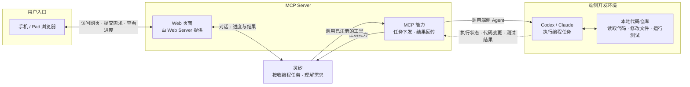

```mermaid
flowchart LR
    subgraph client["用户入口"]
        device["手机 / Pad 浏览器"]
    end

    subgraph server["MCP Server"]
        page["Web 页面<br/>由 Web Server 提供"]
        tools["MCP 能力<br/>任务下发 · 结果回传"]
    end
    lingxi["灵矽<br/>接收编程任务 · 理解需求"]

    subgraph edge["端侧开发环境"]
        agents["Codex / Claude<br/>执行编程任务"]
        workspace["本地代码仓库<br/>读取代码 · 修改文件 · 运行测试"]
        agents <--> workspace
    end

    device <-->|"访问网页 · 提交需求 · 查看进度"| page
    page <-->|"对话 · 进度与结果"| lingxi
    tools -->|"注册能力"| lingxi
    lingxi -->|"调用已注册的工具"| tools
    tools -->|"调用端侧 Agent"| agents
    agents -.->|"执行状态 · 代码变更 · 测试结果"| tools
```

MCP Server 一方面向灵矽注册编程工具能力，供灵矽在任务编排时调用；另一方面通过 Web Server 提供页面，供手机 / Pad 浏览器访问。用户在页面上与灵矽对话，灵矽调用 MCP Server 的能力驱动端侧 Codex / Claude 在本地仓库中读取、编写和测试代码，进度与结果再经灵矽返回页面。
