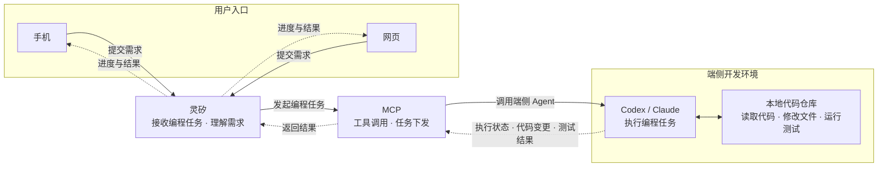

```mermaid
flowchart LR
    subgraph client["用户入口"]
        mobile["手机"]
        web["网页"]
    end

    lingxi["灵矽<br/>接收编程任务 · 理解需求"]
    mcp["MCP<br/>工具调用 · 任务下发"]

    subgraph edge["端侧开发环境"]
        agents["Codex / Claude<br/>执行编程任务"]
        workspace["本地代码仓库<br/>读取代码 · 修改文件 · 运行测试"]
        agents <--> workspace
    end

    mobile -->|"提交需求"| lingxi
    web -->|"提交需求"| lingxi
    lingxi -->|"发起编程任务"| mcp
    mcp -->|"调用端侧 Agent"| agents
    agents -.->|"执行状态 · 代码变更 · 测试结果"| mcp
    mcp -.->|"返回结果"| lingxi
    lingxi -.->|"进度与结果"| mobile
    lingxi -.->|"进度与结果"| web
```

灵矽负责接收和编排任务，MCP 作为工具调用接口，端侧 Codex / Claude 在本地仓库中实际读取、编写和测试代码。
